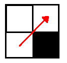
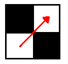
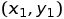
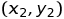
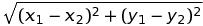
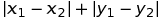
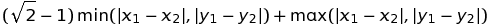
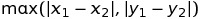

# Pathplanning.ru :: автоматическое планирование траектории 
Леонов Алексей, 161 группа.

Проектная работа, 2 курс.

## Актуальность решаемых задач и обзор существующих решений.

Планирование траектории является важнейшей задачей в робототехнике. Для построения беспилотных транспортных средств необходимы алгоритмы, управляющие перемещением этих средств в пространстве, выбирающие для их движения оптимальный (как правило по длине) путь.
Также оно используется в автомобильных навигаторах, чтобы подсказывать дорогу до определённой точки назначения.
Помимо этого многие картографические сервисы (например, Яндекс.Карты) предоставляют такой функционал, как прокладывание маршрута между двумя выбранными точками.

Для планирования траектории на плоскости применяют разбиение плоскости на пиксели (клетки), которые отмечаются как доступные для прохождения, либо как препятствия, после чего задача нахождения пути сводится к поиску оптимального пути в графе из этих клеток.
Для поиска кратчайшего пути в графе существует множество алгоритмов, включая алгоритмы эвристического поиска семейства A*, такие как A*, Theta*, JPS.

## Используемые технологические решения.

В качестве языка программирования был выбран C++, поскольку он сочетает удобство использования, например поддержку объектно-ориентированного программирования, скорость и оптимальное использование оперативной памяти. Кроме того С++ поддерживается большинством платформ, что особенно важно для использования кода во встроенных системах. Важно и то, что стандартная библиотека C++ содержит классы для множества структур данных, которые будут активно использоваться в проекте.

Для обработки входных и выходных данных в формате xml проект использует библиотеку tinyxml2, что обусловлено её простотой использования и кроссплатформенностью.

Для разработки проекта используется среда разработки Qt Creator.

В качестве инструмента сборки используется утилита CMake. Кроме того проект можно собрать с помощью QT Creator, используя .pro файл.

## План реализации.

+ Реализовать алгоритм Дейкстры и A*. (20-25 января)

+ Добавить поддержку различных опций поиска. (20-25 февраля)

+ Оптимизировать алгоритмы Дейкстры и A*, используя оптимальные структуры данных. (20-25 марта)

+ Реализовать алгоритмы Theta* и JPS. (20-25 апреля)

## Формат входных данных.

Программа принимает на вход xml-файл с описанием запроса (примеры входных файлов в папке examples). Корень xml-файла, то есть тег root, содержит три тега: map, algorithm и options.

### Тег map

Содержит описание карты.

+ width и height -- ширина и высота карты в клетках.

+ cellsize -- необязательный тег, означающий какому расстоянию соответствует клетка на карте. Является целым числом.

+ startx, starty, finishx, finishy -- координаты начала и конца пути. Нумеруются слева направо и снизу вверх, начиная с нуля.

+ grid -- содержит таблицу из строк, заключённых в тег row. Строка содержит нули и единицы. Единица соответствует свободной клетке, а ноль -- клетке, занятой препятствием.

### Тег algorithm

Содержит описание алгоритма.

+ searchtype -- алгоритм, который будет использоваться для поиска пути. Возможные значения тега: dijkstra, astar, jp_search, theta.

+ metrictype -- метрика, которая будет использоваться алгоритмом. Возможные значения тега: diagonal, manhattan, euclidean, chebyshev (см. описания метрик далее).

+ breakingties -- определяет, как будет выбираться следующая вершина графа при выборе среди нескольких с одинаковым значением F.

+ hweight -- вес эвристики.

+ allowdiagonal -- определяет, возможно ли перемещаться по диагонали. Принимает значения true или false.

+ cutcorners -- определяет, возможно перемещаться между двумя клетками по диагонали, когда одна из клеток смежных с обоими занята, то есть путь проходит по диагонали через угол препятствия. Принимает значения true или false.

+ allowsqueeze -- определяет, возможно перемещаться между двумя клетками по диагонали, когда обе клетки, смежные с обоими заняты, то есть можно ли "просачиваться" между двумя клетками препятсвия, расположенными по диагонали друг относительно друга. Содержит true или false.

### Тег options

+ loglevel -- определяет насколько подробным должен быть ответ на запрос. Возможны значения от 0 (none), 0.5 (tiny), 1 (short), 1.5 (medium), 2(full) (чем больше число, тем более подробный ответ).

+ logpath -- определяет путь до файла, который будет являться ответом на запрос. По умолчанию -- текущая директрия.

+ logfilename -- определяет имя файла, который будет являться ответом на запрос. По умолчанию -- \[имя входного файла\]\_log.xml

## Формат выходных данных.

Выходной xml файл содержит ту же информацию, что и входной, но кроме этого в теге root содержится тег log с ответом на запрос. В него вложены следующие теги:

+ mapfilename -- адрес выходного файла

+ summary -- имеет аттрибуты: numberofsteps -- количество шагов, выполненных алгоритмом, nodescreated -- количество вершин, созданных при работе алгорита, length -- длину найденного пути, length_scaled -- длину найденного пути с учётом размера одной клетки (параметр cellsize), time -- время поиска пути.

+ path -- таблица, как в входном файле, на которой звёздочками отмечена траектория.

+ lplevel -- полный список вершин на пути. Вершина описывается в виде тега node, имеющего аттрибуты x, y (координаты) и number (номер в пути).

+ hplevel -- описание пути в виде последовательности отрезков, которые описываются в следующем формате: тег section с аттрибутами start.x, start.y, finish.x, finish.y (координаты начала и конца), length (длина), number (номер в пути).

## Доступные метрики

Выбор метрики определяет как будет рассчитываться расстояние между клетками с координатами  и 

#### Эвклидова метрика

#### Манхеттенская метрика

#### Диагональная метрика

#### Метрика Чебышёва

## Архитектура программы

Обрабатывает входные данные и записывает результат поиска в выходной файл класс XMLLogger, использующий библиотеку tinyxml2.

Данные о карте и опциях поиска хранятся в классах Map и EnvironmentOptions соответственно.

Код алгоритма поиска реализован в методе startSearch класса Isearch. От него наследуется класс Astar, от которого в свою очередь наследуются классы Dijkstra, Thetta и JP_Search. Таким образом, основной код, общий для всех алгоритмов, не дублируется.

## Компиляция, установка и запуск программы

Программу можно скопилировать с помощью программы Cmake, используя файл CMakeLists.txt, либо с помощью среды разработки QT Creator, используя проектный файл path-planning.pro.

Полученный в результате бинарный файл можно запускать, передавая в качестве аргумента командной строки путь к входному xml-файлу в описанном выше формате. В результате в выходном файле будет записан результат поиска в описанном выше формате. 

## Реализованная функциональность

На данный момент реализованны алгоритм Дейкстры, A* и Thetta. Для них поддерживаются все описанные в разделе "Формат входных данных" опции.
